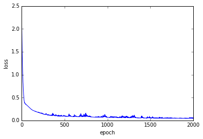
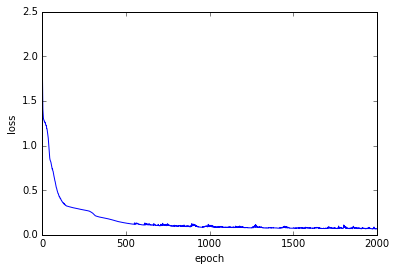
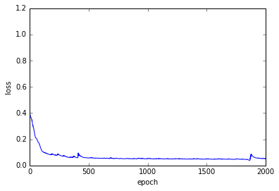

# Paper: Targeted Nonlinear Adversarial Perturbations in Images and Videos

Learn (convnet-generated) adversarial perturbations for a single image or video:


where X = original image or video, P = perturbation generator (a convnet), X' = perturbed image or video, M = image or video classification model, y' = output of model M with input X', loss = the loss used for backpropagation. The backpropagated loss was used to update the parameters of model P, and the process was repeated for a number of epochs.

Below is the code used to run the perturbations on images and video alluded to in the paper.

# Image perturbations

## Image sample 1


```python
%matplotlib inline
import numpy as np
import matplotlib.pyplot as plt
from img_perts import perturbate

file_name = "dog"

image_path = "data/image_samples/{}.jpg".format(file_name)
save_to_dir = "data/perturbations/{}".format(file_name)

perturbate.main(
    image_path=image_path,
    kernel_size=3,
    nblocks=3,
    nlayers=3,
    epochs=2000,#000,
    lr=0.001,
    l1_coeff=1.0,
    class_index="max",
    init_pert_model=True,
    save_to_dir=save_to_dir,
    datetime_subdir=True,
)
```





    100%|██████████| 2000/2000 [07:35<00:00,  4.39it/s]


    original score: tensor([ 0.8234,  0.1412,  0.0236,  0.0031,  0.0016], device='cuda:0')
    perturbed score: tensor(1.00000e-04 *
           [ 3.3763,  0.3358,  0.0243,  0.0665,  0.6410], device='cuda:0')
    original input evaluation:
    5 top classes identified by the model:
    (class index) class description: model score
    (222) kuvasz: 0.823425173759
    (257) Great Pyrenees: 0.141241371632
    (207) golden retriever: 0.0236044339836
    (208) Labrador retriever: 0.00311248097569
    (229) Old English sheepdog, bobtail: 0.00158786645625
    
    
    perturbated input evaluation:
    5 top classes identified by the model:
    (class index) class description: model score
    (87) African grey, African gray, Psittacus erithacus: 0.996096909046
    (676) muzzle: 0.000698636402376
    (222) kuvasz: 0.000337631383445
    (251) dalmatian, coach dog, carriage dog: 0.000262596004177
    (840) swab, swob, mop: 0.000200480382773
    
    
    results saved to:
    original image saved to data/perturbations/dog/2018-07-22 15:39:08.328737/original.jpg
    perturbated image saved to data/perturbations/dog/2018-07-22 15:39:08.328737/perturbated.jpg
    differences image saved to data/perturbations/dog/2018-07-22 15:39:08.328737/differences.jpg
    scores saved to: data/perturbations/dog/2018-07-22 15:39:08.328737/scores.csv
    perturbation generator model saved to: data/perturbations/dog/2018-07-22 15:39:08.328737/pert_model.pt
    
    loss history saved to: data/perturbations/dog/2018-07-22 15:39:08.328737/loss_history
    


## Image sample 2


```python
%matplotlib inline
import numpy as np
import matplotlib.pyplot as plt
from img_perts import perturbate

file_name = "cat"

image_path = "data/image_samples/{}.jpg".format(file_name)
save_to_dir = "data/perturbations/{}".format(file_name)

perturbate.main(
    image_path=image_path,
    kernel_size=3,
    nblocks=3,
    nlayers=3,
    epochs=2000,#000,
    lr=0.001,
    l1_coeff=1.0,
    class_index="max",
    init_pert_model=True,
    save_to_dir=save_to_dir,
    datetime_subdir=True,
)
```


    100%|██████████| 2000/2000 [07:43<00:00,  4.31it/s]
    img_perts/deep_explanation.py:218: UserWarning: Implicit dimension choice for softmax has been deprecated. Change the call to include dim=X as an argument.
      
    img_perts/deep_explanation.py:219: UserWarning: Implicit dimension choice for softmax has been deprecated. Change the call to include dim=X as an argument.
      def load_input(image_path, graph=False):


    original score: tensor([ 0.8022,  0.1246,  0.0701,  0.0011,  0.0004], device='cuda:0')
    perturbed score: tensor(1.00000e-04 *
           [ 1.4497,  0.3377,  3.5105,  0.2533,  0.1127], device='cuda:0')
    original input evaluation:


    img_perts/deep_explanation.py:366: UserWarning: Implicit dimension choice for softmax has been deprecated. Change the call to include dim=X as an argument.
      return outputs


    5 top classes identified by the model:
    (class index) class description: model score
    (281) tabby, tabby cat: 0.802203714848
    (282) tiger cat: 0.124585837126
    (285) Egyptian cat: 0.0701399073005
    (283) Persian cat: 0.00106593884993
    (539) doormat, welcome mat: 0.000402584497351
    
    
    perturbated input evaluation:
    5 top classes identified by the model:
    (class index) class description: model score
    (145) king penguin, Aptenodytes patagonica: 0.987671971321
    (83) prairie chicken, prairie grouse, prairie fowl: 0.00900631211698
    (331) hare: 0.000443105003797
    (285) Egyptian cat: 0.000351052818587
    (146) albatross, mollymawk: 0.000272949255304
    
    
    results saved to:
    original image saved to data/perturbations/cat/2018-07-22 15:23:36.936765/original.jpg
    perturbated image saved to data/perturbations/cat/2018-07-22 15:23:36.936765/perturbated.jpg
    differences image saved to data/perturbations/cat/2018-07-22 15:23:36.936765/differences.jpg
    scores saved to: data/perturbations/cat/2018-07-22 15:23:36.936765/scores.csv
    perturbation generator model saved to: data/perturbations/cat/2018-07-22 15:23:36.936765/pert_model.pt
    
    loss history saved to: data/perturbations/cat/2018-07-22 15:23:36.936765/loss_history
    


## Image sample 3


```python
%matplotlib inline
import numpy as np
import matplotlib.pyplot as plt
from img_perts import perturbate

file_name = "cat2"

image_path = "data/image_samples/{}.jpg".format(file_name)
save_to_dir = "data/perturbations/{}".format(file_name)

perturbate.main(
    image_path=image_path,
    kernel_size=3,
    nblocks=3,
    nlayers=3,
    epochs=2000,#000,
    lr=0.001,
    l1_coeff=1.0,
    class_index="max",
    init_pert_model=True,
    save_to_dir=save_to_dir,
    datetime_subdir=True,
)
```


    100%|██████████| 2000/2000 [07:34<00:00,  4.40it/s]
    img_perts/deep_explanation.py:223: UserWarning: Implicit dimension choice for softmax has been deprecated. Change the call to include dim=X as an argument.
      plt.figure("original image")
    img_perts/deep_explanation.py:224: UserWarning: Implicit dimension choice for softmax has been deprecated. Change the call to include dim=X as an argument.
      plt.imshow(img)


    original score: tensor([ 0.5098,  0.2082,  0.0819,  0.0631,  0.0317], device='cuda:0')
    perturbed score: tensor(1.00000e-03 *
           [ 3.4428,  1.6645,  0.5694,  3.4967,  1.7787], device='cuda:0')
    original input evaluation:


    img_perts/deep_explanation.py:371: UserWarning: Implicit dimension choice for softmax has been deprecated. Change the call to include dim=X as an argument.
      


    5 top classes identified by the model:
    (class index) class description: model score
    (285) Egyptian cat: 0.50977897644
    (281) tabby, tabby cat: 0.208158865571
    (282) tiger cat: 0.0818989351392
    (904) window screen: 0.0630929172039
    (905) window shade: 0.0317366085947
    
    
    perturbated input evaluation:
    5 top classes identified by the model:
    (class index) class description: model score
    (782) screen, CRT screen: 0.368403911591
    (664) monitor: 0.324531376362
    (851) television, television system: 0.176783695817
    (508) computer keyboard, keypad: 0.0432575643063
    (681) notebook, notebook computer: 0.0202351231128
    
    
    results saved to:
    original image saved to data/perturbations/cat2/2018-07-22 15:31:22.377249/original.jpg
    perturbated image saved to data/perturbations/cat2/2018-07-22 15:31:22.377249/perturbated.jpg
    differences image saved to data/perturbations/cat2/2018-07-22 15:31:22.377249/differences.jpg
    scores saved to: data/perturbations/cat2/2018-07-22 15:31:22.377249/scores.csv
    perturbation generator model saved to: data/perturbations/cat2/2018-07-22 15:31:22.377249/pert_model.pt
    
    loss history saved to: data/perturbations/cat2/2018-07-22 15:31:22.377249/loss_history
    


## Image sample 4


```python
%matplotlib inline
import numpy as np
import matplotlib.pyplot as plt
from img_perts import perturbate

file_name = "car"

image_path = "data/image_samples/{}.jpg".format(file_name)
save_to_dir = "data/perturbations/{}".format(file_name)

perturbate.main(
    image_path=image_path,
    kernel_size=3,
    nblocks=3,
    nlayers=3,
    epochs=2000,#000,
    lr=0.001,
    l1_coeff=1.0,
    class_index="max",
    init_pert_model=True,
    save_to_dir=save_to_dir,
    datetime_subdir=True,
)
```


    100%|██████████| 2000/2000 [07:42<00:00,  4.33it/s]
    img_perts/deep_explanation.py:213: UserWarning: Implicit dimension choice for softmax has been deprecated. Change the call to include dim=X as an argument.
      print "original score: {}".format(torch.nn.Softmax()(vgg_model(img))[0, categories])
    img_perts/deep_explanation.py:214: UserWarning: Implicit dimension choice for softmax has been deprecated. Change the call to include dim=X as an argument.
      print "perturbed score: {}".format(torch.nn.Softmax()(vgg_model(pert_img))[0, categories])


    original score: tensor([ 0.5307,  0.1315,  0.1093,  0.1037,  0.0631], device='cuda:0')
    perturbed score: tensor(1.00000e-03 *
           [ 2.6458,  2.2830,  0.5999,  0.5904,  0.2433], device='cuda:0')
    original input evaluation:


    img_perts/deep_explanation.py:361: UserWarning: Implicit dimension choice for softmax has been deprecated. Change the call to include dim=X as an argument.
      outputs = torch.nn.Softmax()(model(x_tensor))


    5 top classes identified by the model:
    (class index) class description: model score
    (817) sports car, sport car: 0.530656099319
    (479) car wheel: 0.131468653679
    (581) grille, radiator grille: 0.109313197434
    (511) convertible: 0.103721126914
    (436) beach wagon, station wagon, wagon, estate car, beach waggon, station waggon, waggon: 0.0631403699517
    
    
    perturbated input evaluation:
    5 top classes identified by the model:
    (class index) class description: model score
    (408) amphibian, amphibious vehicle: 0.978337585926
    (751) racer, race car, racing car: 0.00674718478695
    (814) speedboat: 0.00620162859559
    (817) sports car, sport car: 0.00264584389515
    (479) car wheel: 0.00228302320465
    
    
    results saved to:
    original image saved to data/perturbations/car/2018-07-22 15:15:42.316242/original.jpg
    perturbated image saved to data/perturbations/car/2018-07-22 15:15:42.316242/perturbated.jpg
    differences image saved to data/perturbations/car/2018-07-22 15:15:42.316242/differences.jpg


    /usr/lib/python2.7/dist-packages/skimage/io/_plugins/pil_plugin.py:96: FutureWarning: Conversion of the second argument of issubdtype from `float` to `np.floating` is deprecated. In future, it will be treated as `np.float64 == np.dtype(float).type`.
      if np.issubdtype(arr.dtype, float):


    scores saved to: data/perturbations/car/2018-07-22 15:15:42.316242/scores.csv
    perturbation generator model saved to: data/perturbations/car/2018-07-22 15:15:42.316242/pert_model.pt
    
    loss history saved to: data/perturbations/car/2018-07-22 15:15:42.316242/loss_history
    


## Image sample 5


```python
%matplotlib inline
import numpy as np
import matplotlib.pyplot as plt
from img_perts import perturbate

file_name = "excavator"

image_path = "data/image_samples/{}.jpg".format(file_name)
save_to_dir = "data/perturbations/{}".format(file_name)

perturbate.main(
    image_path=image_path,
    kernel_size=3,
    nblocks=3,
    nlayers=3,
    epochs=2000,#000,
    lr=0.001,
    l1_coeff=1.0,
    class_index="max",
    init_pert_model=True,
    save_to_dir=save_to_dir,
    datetime_subdir=True,
)
```





    100%|██████████| 2000/2000 [07:34<00:00,  4.40it/s]


    original score: tensor([ 0.9656,  0.0204,  0.0024,  0.0021,  0.0008], device='cuda:0')
    perturbed score: tensor(1.00000e-03 *
           [ 2.7633,  0.6131,  0.1401,  0.1156,  0.1987], device='cuda:0')
    original input evaluation:
    5 top classes identified by the model:
    (class index) class description: model score
    (517) crane: 0.965572297573
    (913) wreck: 0.020407076925
    (595) harvester, reaper: 0.00241595739499
    (510) container ship, containership, container vessel: 0.00212941667996
    (730) plow, plough: 0.000826664734632
    
    
    perturbated input evaluation:
    5 top classes identified by the model:
    (class index) class description: model score
    (674) mousetrap: 0.222181156278
    (481) cassette: 0.146628186107
    (605) iPod: 0.0957641899586
    (710) pencil sharpener: 0.0585163719952
    (851) television, television system: 0.056191008538
    
    
    results saved to:
    original image saved to data/perturbations/excavator/2018-07-22 15:46:53.904665/original.jpg
    perturbated image saved to data/perturbations/excavator/2018-07-22 15:46:53.904665/perturbated.jpg
    differences image saved to data/perturbations/excavator/2018-07-22 15:46:53.904665/differences.jpg
    scores saved to: data/perturbations/excavator/2018-07-22 15:46:53.904665/scores.csv
    perturbation generator model saved to: data/perturbations/excavator/2018-07-22 15:46:53.904665/pert_model.pt
    
    loss history saved to: data/perturbations/excavator/2018-07-22 15:46:53.904665/loss_history
    


## Image sample 6


```python
%matplotlib inline
import numpy as np
import matplotlib.pyplot as plt
from img_perts import perturbate

file_name = "palace"

image_path = "data/image_samples/{}.jpg".format(file_name)
save_to_dir = "data/perturbations/{}".format(file_name)

perturbate.main(
    image_path=image_path,
    kernel_size=3,
    nblocks=3,
    nlayers=3,
    epochs=2000,#000,
    lr=0.001,
    l1_coeff=1.0,
    class_index="max",
    init_pert_model=True,
    save_to_dir=save_to_dir,
    datetime_subdir=True,
)
```


    100%|██████████| 2000/2000 [07:50<00:00,  4.25it/s]


    original score: tensor([ 0.7823,  0.0370,  0.0344,  0.0290,  0.0265], device='cuda:0')
    perturbed score: tensor(1.00000e-03 *
           [ 2.4122,  0.5660,  1.4265,  0.3527,  1.9176], device='cuda:0')
    original input evaluation:
    5 top classes identified by the model:
    (class index) class description: model score
    (483) castle: 0.782301783562
    (975) lakeside, lakeshore: 0.037042953074
    (576) gondola: 0.0343679413199
    (833) submarine, pigboat, sub, U-boat: 0.0290066376328
    (536) dock, dockage, docking facility: 0.0265274904668
    
    
    perturbated input evaluation:
    5 top classes identified by the model:
    (class index) class description: model score
    (526) desk: 0.414985775948
    (527) desktop computer: 0.14139971137
    (664) monitor: 0.0752502381802
    (782) screen, CRT screen: 0.0506206452847
    (762) restaurant, eating house, eating place, eatery: 0.0197616908699
    
    
    results saved to:
    original image saved to data/perturbations/palace/2018-07-22 16:02:56.023002/original.jpg
    perturbated image saved to data/perturbations/palace/2018-07-22 16:02:56.023002/perturbated.jpg
    differences image saved to data/perturbations/palace/2018-07-22 16:02:56.023002/differences.jpg
    scores saved to: data/perturbations/palace/2018-07-22 16:02:56.023002/scores.csv
    perturbation generator model saved to: data/perturbations/palace/2018-07-22 16:02:56.023002/pert_model.pt
    
    loss history saved to: data/perturbations/palace/2018-07-22 16:02:56.023002/loss_history
    


## Dog to polar bear


```python
%matplotlib inline
import numpy as np
import matplotlib.pyplot as plt
from img_perts import perturbate2

file_name = "dog"

image_path = "data/image_samples/{}.jpg".format(file_name)
save_to_dir = "data/perturbations/{}/to_polar_bear".format(file_name)

perturbate2.main(
    image_path=image_path,
    kernel_size=3,
    nblocks=3,
    nlayers=3,
    epochs=2000,#000,
    lr=0.001,
    l1_coeff=1.0,
    class_index=296, # (296) ice bear, polar bear, Ursus Maritimus, Thalarctos maritimus
    minimize_class=False, # maximize
    init_pert_model=True,
    save_to_dir=save_to_dir,
    datetime_subdir=True,
)
```


    100%|██████████| 2000/2000 [08:13<00:00,  4.05it/s]
    img_perts/perturbate.py:229: UserWarning: Implicit dimension choice for softmax has been deprecated. Change the call to include dim=X as an argument.
      print "original score: {}".format(torch.nn.Softmax()(vgg_model(img))[0, categories])
    img_perts/perturbate.py:230: UserWarning: Implicit dimension choice for softmax has been deprecated. Change the call to include dim=X as an argument.
      print "perturbed score: {}".format(torch.nn.Softmax()(vgg_model(pert_img))[0, categories])


    original score: tensor(1.00000e-04 *
           [ 5.1595], device='cuda:0')
    perturbed score: tensor([ 0.9973], device='cuda:0')
    original input evaluation:


    img_perts/perturbate.py:377: UserWarning: Implicit dimension choice for softmax has been deprecated. Change the call to include dim=X as an argument.
      outputs = torch.nn.Softmax()(model(x_tensor))


    5 top classes identified by the model:
    (class index) class description: model score
    (222) kuvasz: 0.823425173759
    (257) Great Pyrenees: 0.141241371632
    (207) golden retriever: 0.0236044339836
    (208) Labrador retriever: 0.00311248097569
    (229) Old English sheepdog, bobtail: 0.00158786645625
    
    
    perturbated input evaluation:
    5 top classes identified by the model:
    (class index) class description: model score
    (296) ice bear, polar bear, Ursus Maritimus, Thalarctos maritimus: 0.997341692448
    (222) kuvasz: 0.00108521152288
    (257) Great Pyrenees: 0.000606264104135
    (270) white wolf, Arctic wolf, Canis lupus tundrarum: 0.00037263968261
    (258) Samoyed, Samoyede: 0.000170646904735
    
    
    results saved to:
    original image saved to data/perturbations/dog/to_polar_bear/2018-07-23 15:47:53.201220/original.jpg
    perturbated image saved to data/perturbations/dog/to_polar_bear/2018-07-23 15:47:53.201220/perturbated.jpg
    differences image saved to data/perturbations/dog/to_polar_bear/2018-07-23 15:47:53.201220/differences.jpg


    /usr/lib/python2.7/dist-packages/skimage/io/_plugins/pil_plugin.py:96: FutureWarning: Conversion of the second argument of issubdtype from `float` to `np.floating` is deprecated. In future, it will be treated as `np.float64 == np.dtype(float).type`.
      if np.issubdtype(arr.dtype, float):


    scores saved to: data/perturbations/dog/to_polar_bear/2018-07-23 15:47:53.201220/scores.csv
    perturbation generator model saved to: data/perturbations/dog/to_polar_bear/2018-07-23 15:47:53.201220/pert_model.pt
    
    loss history saved to: data/perturbations/dog/to_polar_bear/2018-07-23 15:47:53.201220/loss_history
    


# Video perturbations

First restart the notebook (the perturbations module for videos is also named "perturbate").


```python
from IPython.core.display import HTML
HTML("<script>Jupyter.notebook.kernel.restart()</script>")
```

## Video Sample 1


```python
%matplotlib inline
import numpy as np
import matplotlib.pyplot as plt
from video_perts import perturbate

sample_name = "scuba_diving"

video_path = "data/video_samples/{}/processed.mp4".format(sample_name)
save_to_dir = "data/video_perturbations/{}".format(sample_name)

perturbate.main(
    input_path=video_path,
    kernel_size=(3, 3, 3),
    nblocks=3,
    nlayers=3,
    epochs=2000,
    lr=0.01,
    l1_coeff=1.0,
    init_pert_model=True,
    save_to_dir=save_to_dir,
    datetime_subdir=True,
    graph=False,
    loss_figname="loss",
)
```


    100%|██████████| 2000/2000 [1:02:18<00:00,  1.87s/it]


    original class score: tensor([ 0.8783,  0.1186,  0.0027,  0.0002,  0.0001], device='cuda:0')
    perturbed class score: tensor(1.00000e-04 *
           [ 4.0324,  0.0278,  0.0370,  0.0282,  0.1205], device='cuda:0')
    
    original input evaluation:
    Top 5 classes and associated probabilities: 
    (class index) class description: model score
    (286) scuba diving: 0.878279447556
    (321) snorkeling: 0.118646353483
    (62) cleaning pool: 0.00274578807876
    (329) springboard diving: 0.000245938339503
    (172) jumping into pool: 6.03955049883e-05
    
    perturbated input evaluation:
    Top 5 classes and associated probabilities: 
    (class index) class description: model score
    (317) smoking hookah: 0.996110975742
    (316) smoking: 0.00334095722064
    (286) scuba diving: 0.000403238722356
    (341) swimming butterfly stroke: 9.40493191592e-05
    (337) surfing water: 1.60787585628e-05
    
    results saved to:
    data/video_perturbations/scuba_diving/2018-07-23 03:18:04.169892/differences.mp4
    data/video_perturbations/scuba_diving/2018-07-23 03:18:04.169892/original_224x224.mp4
    data/video_perturbations/scuba_diving/2018-07-23 03:18:04.169892/perturbated.mp4
    
    perturbation generator model saved to:
    data/video_perturbations/scuba_diving/2018-07-23 03:18:04.169892/pert_model.pt
    
    loss history saved to:
    data/video_perturbations/scuba_diving/2018-07-23 03:18:04.169892/loss_history
    
    scores saved to: data/video_perturbations/scuba_diving/2018-07-23 03:18:04.169892/scores.csv


```python
save_to_dir = "data/video_perturbations/scuba_diving/2018-07-23 03:18:04.169892"
perturbate.plot_results(save_to_dir)
```

## Video Sample 2


```python
%matplotlib inline
import numpy as np
import matplotlib.pyplot as plt
from video_perts import perturbate

sample_name = "punching_bag"

video_path = "data/video_samples/{}/processed.mp4".format(sample_name)
save_to_dir = "data/video_perturbations/{}".format(sample_name)

deep_explanation.main(
    input_path=video_path,
    kernel_size=(3, 3, 3),
    nblocks=3,
    nlayers=3,
    epochs=2000,
    lr=0.01,
    l1_coeff=1.0,
    init_pert_model=True,
    save_to_dir=save_to_dir,
    datetime_subdir=True,
    graph=False,
    loss_figname="loss",
)
```


    100%|██████████| 2000/2000 [1:00:25<00:00,  1.81s/it]


    original class score: tensor([ 0.9192,  0.0297,  0.0224,  0.0048,  0.0030], device='cuda:0')
    perturbed class score: tensor(1.00000e-04 *
           [ 2.4181,  5.1474,  1.2727,  0.0508,  0.4780], device='cuda:0')
    
    original input evaluation:
    Top 5 classes and associated probabilities: 
    (class index) class description: model score
    (258) punching bag: 0.91917347908
    (105) drop kicking: 0.0296538285911
    (302) side kick: 0.0223926380277
    (259) punching person (boxing): 0.00478684389964
    (120) exercising with an exercise ball: 0.00302171171643
    
    perturbated input evaluation:
    Top 5 classes and associated probabilities: 
    (class index) class description: model score
    (34) breakdancing: 0.965005874634
    (306) skateboarding: 0.014236423187
    (173) jumpstyle dancing: 0.00587026821449
    (179) krumping: 0.00345934508368
    (349) tap dancing: 0.00263738399372
    
    results saved to:
    data/video_perturbations/punching_bag/2018-07-23 02:15:40.900206/differences.mp4
    data/video_perturbations/punching_bag/2018-07-23 02:15:40.900206/original_224x224.mp4
    data/video_perturbations/punching_bag/2018-07-23 02:15:40.900206/perturbated.mp4
    
    perturbation generator model saved to:
    data/video_perturbations/punching_bag/2018-07-23 02:15:40.900206/pert_model.pt
    
    loss history saved to:
    data/video_perturbations/punching_bag/2018-07-23 02:15:40.900206/loss_history
    
    scores saved to: data/video_perturbations/punching_bag/2018-07-23 02:15:40.900206/scores.csv


```python
save_to_dir = "data/video_perturbations/punching_bag/2018-07-23 02:15:40.900206"
perturbate.plot_results(save_to_dir)
```

## Video Sample 3


```python
%matplotlib inline
import numpy as np
import matplotlib.pyplot as plt
from video_perts import perturbate

sample_name = "mowing_lawn"

video_path = "data/video_samples/{}/processed.mp4".format(sample_name)
save_to_dir = "data/video_perturbations/{}".format(sample_name)

perturbate.main(
    input_path=video_path,
    kernel_size=(3, 3, 3),
    nblocks=3,
    nlayers=3,
    epochs=2000,
    lr=0.01,
    l1_coeff=1.0,
    init_pert_model=True,
    save_to_dir=save_to_dir,
    datetime_subdir=True,
    graph=False,
    loss_figname="loss",
)
```


    100%|██████████| 2000/2000 [1:02:16<00:00,  1.87s/it]


    original class score: tensor([ 0.9727,  0.0244,  0.0028,  0.0000,  0.0000], device='cuda:0')
    perturbed class score: tensor(1.00000e-04 *
           [ 1.4000,  0.9696,  1.0609,  0.3011,  0.0007], device='cuda:0')
    
    original input evaluation:
    Top 5 classes and associated probabilities: 
    (class index) class description: model score
    (201) mowing lawn: 0.972674787045
    (378) walking the dog: 0.0244405660778
    (363) training dog: 0.00283232703805
    (338) sweeping floor: 1.45368485391e-05
    (25) blowing leaves: 1.36257431222e-05
    
    perturbated input evaluation:
    Top 5 classes and associated probabilities: 
    (class index) class description: model score
    (360) tobogganing: 0.99878436327
    (28) bobsledding: 0.00066970550688
    (201) mowing lawn: 0.000140000367537
    (42) canoeing or kayaking: 0.000116581104521
    (363) training dog: 0.000106086059532
    
    results saved to:
    data/video_perturbations/mowing_lawn/2018-07-23 01:15:10.280387/differences.mp4
    data/video_perturbations/mowing_lawn/2018-07-23 01:15:10.280387/original_224x224.mp4
    data/video_perturbations/mowing_lawn/2018-07-23 01:15:10.280387/perturbated.mp4
    
    perturbation generator model saved to:
    data/video_perturbations/mowing_lawn/2018-07-23 01:15:10.280387/pert_model.pt
    
    loss history saved to:
    data/video_perturbations/mowing_lawn/2018-07-23 01:15:10.280387/loss_history
    
    scores saved to: data/video_perturbations/mowing_lawn/2018-07-23 01:15:10.280387/scores.csv


```python
save_to_dir = "data/video_perturbations/mowing_lawn/2018-07-23 01:15:10.280387"
perturbate.plot_results(save_to_dir)
```

## Video Sample 4


```python
%matplotlib inline
import numpy as np
import matplotlib.pyplot as plt
from video_perts import perturbate

sample_name = "drinking_beer"

video_path = "data/video_samples/{}/processed.mp4".format(sample_name)
save_to_dir = "data/video_perturbations/{}".format(sample_name)

perturbate.main(
    input_path=video_path,
    kernel_size=(3, 3, 3),
    nblocks=3,
    nlayers=3,
    epochs=2000,
    lr=0.01,
    l1_coeff=1.0,
    init_pert_model=True,
    save_to_dir=save_to_dir,
    datetime_subdir=True,
    graph=False,
    loss_figname="loss",
)
```





    100%|██████████| 2000/2000 [1:02:42<00:00,  1.88s/it]


    original class score: tensor([ 0.4608,  0.2248,  0.2237,  0.0446,  0.0321], device='cuda:0')
    perturbed class score: tensor(1.00000e-05 *
           [ 1.2791,  9.3388,  8.8174,  1.6485,  9.7730], device='cuda:0')
    
    original input evaluation:
    Top 5 classes and associated probabilities: 
    (class index) class description: model score
    (352) tasting beer: 0.460781544447
    (101) drinking beer: 0.224785089493
    (15) bartending: 0.223735421896
    (203) opening bottle: 0.0446103103459
    (100) drinking: 0.0320644378662
    
    perturbated input evaluation:
    Top 5 classes and associated probabilities: 
    (class index) class description: model score
    (313) slacklining: 0.902415752411
    (88) deadlifting: 0.0470117554069
    (149) headbanging: 0.0131791224703
    (255) pull ups: 0.0057046120055
    (260) push up: 0.00212896009907
    
    results saved to:
    data/video_perturbations/drinking_beer/2018-07-22 22:01:41.900350/differences.mp4
    data/video_perturbations/drinking_beer/2018-07-22 22:01:41.900350/original_224x224.mp4
    data/video_perturbations/drinking_beer/2018-07-22 22:01:41.900350/perturbated.mp4
    
    perturbation generator model saved to:
    data/video_perturbations/drinking_beer/2018-07-22 22:01:41.900350/pert_model.pt
    
    loss history saved to:
    data/video_perturbations/drinking_beer/2018-07-22 22:01:41.900350/loss_history
    
    scores saved to: data/video_perturbations/drinking_beer/2018-07-22 22:01:41.900350/scores.csv


```python
save_to_dir = "data/video_perturbations/drinking_beer/2018-07-22 22:01:41.900350"
perturbate.plot_results(save_to_dir)
```

## Video Sample 5


```python
%matplotlib inline
import numpy as np
import matplotlib.pyplot as plt
from video_perts import perturbate

sample_name = "javelin_throw"

video_path = "data/video_samples/{}/processed.mp4".format(sample_name)
save_to_dir = "data/video_perturbations/{}".format(sample_name)

perturbate.main(
    input_path=video_path,
    kernel_size=(3, 3, 3),
    nblocks=3,
    nlayers=3,
    epochs=2000,
    lr=0.01,
    l1_coeff=1.0,
    init_pert_model=True,
    save_to_dir=save_to_dir,
    datetime_subdir=True,
    graph=False,
    loss_figname="loss",
)
```


    100%|██████████| 2000/2000 [1:05:42<00:00,  1.97s/it]


    original class score: tensor([ 0.9913,  0.0042,  0.0012,  0.0010,  0.0008], device='cuda:0')
    perturbed class score: tensor(1.00000e-04 *
           [ 2.9071,  0.5843,  1.9789,  0.0854,  0.3302], device='cuda:0')
    
    original input evaluation:
    Top 5 classes and associated probabilities: 
    (class index) class description: model score
    (166) javelin throw: 0.991295099258
    (182) long jump: 0.00420214561746
    (50) catching or throwing softball: 0.0011763687944
    (358) throwing discus: 0.000968425534666
    (367) triple jump: 0.000764829048421
    
    perturbated input evaluation:
    Top 5 classes and associated probabilities: 
    (class index) class description: model score
    (164) ice skating: 0.937120079994
    (235) playing ice hockey: 0.0256786439568
    (280) roller skating: 0.0196170341223
    (154) hockey stop: 0.00496697798371
    (246) playing tennis: 0.00381563603878
    
    results saved to:
    data/video_perturbations/javelin_throw/2018-07-23 00:12:48.856662/differences.mp4
    data/video_perturbations/javelin_throw/2018-07-23 00:12:48.856662/original_224x224.mp4
    data/video_perturbations/javelin_throw/2018-07-23 00:12:48.856662/perturbated.mp4
    
    perturbation generator model saved to:
    data/video_perturbations/javelin_throw/2018-07-23 00:12:48.856662/pert_model.pt
    
    loss history saved to:
    data/video_perturbations/javelin_throw/2018-07-23 00:12:48.856662/loss_history
    
    scores saved to: data/video_perturbations/javelin_throw/2018-07-23 00:12:48.856662/scores.csv


```python
save_to_dir = "data/video_perturbations/javelin_throw/2018-07-23 00:12:48.856662"
perturbate.plot_results(save_to_dir)
```
